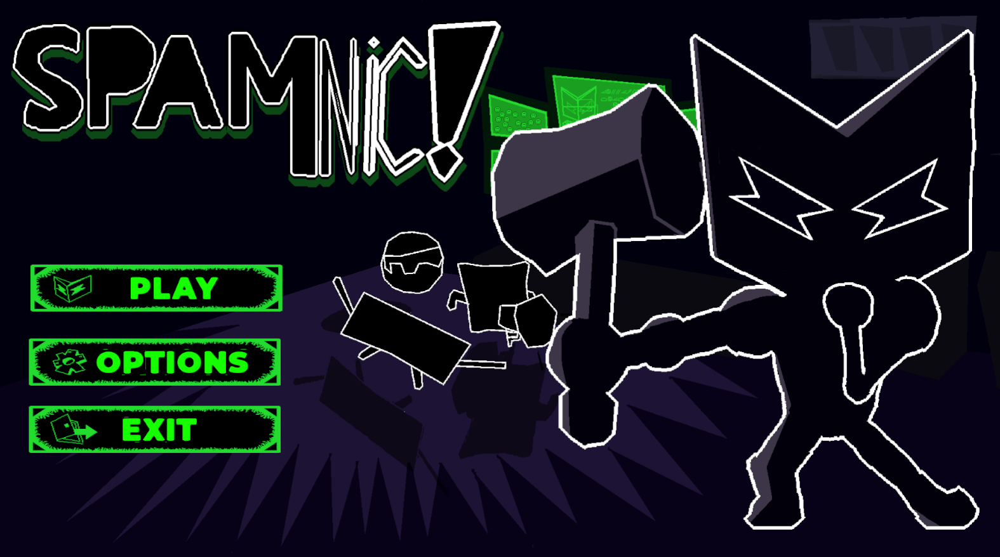

# 👾 Ricardo Sperandio

**`Game Developer • Software Engineering Student`**

Me chamo Ricardo Sperandio, sou desenvolvedor de jogos e apaixonado por tecnologia, programação e criação de experiências interativas. Atualmente estudo Engenharia de Software e venho desenvolvendo projetos voltados para games, sistemas e automações.

---

### 💻🖱️ Linguagens e Tecnologias

 
 

---

### 🚀 Áreas de Interesse

- 🎮 Desenvolvimento de Jogos
- 🧠 Inteligência Artificial para NPCs
- ⚡ Automação de Sistemas
- 🌐 Desenvolvimento Web
- 📦 Arquitetura de Software
- 🕹️ Game Design

---
## 🎮 Projetos

### 🕹️ Spamnic!
Projeto de jogo desenvolvido na Unity com foco em gameplay, mecânicas interativas e experiência do jogador.

🔗 Repositório:  
[👉 Clique para acessar](https://github.com/ricardosperandio/Spamnic)

  

---

